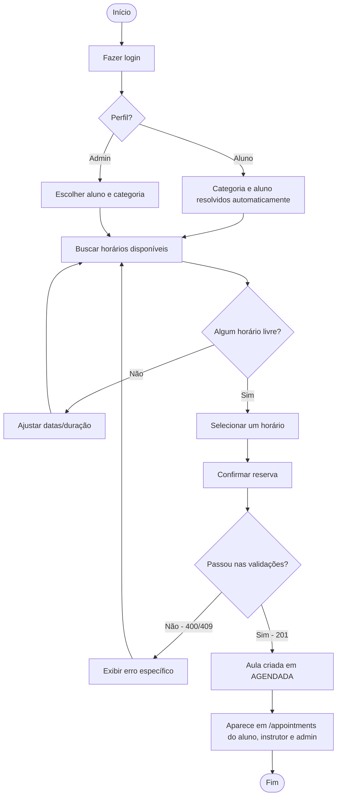

# Diagrama de atividades — fluxo de agendamento de aula

Cobre o fluxo real, de ponta a ponta, para Admin ou Aluno. Não inclui presença/conclusão/cancelamento, que não existem no sistema (toda aula permanece `AGENDADA`).

