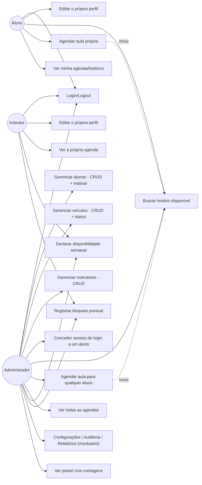

# Diagrama de casos de uso

Casos de uso reais dos três perfis, correspondentes às rotas implementadas em `apps/api/src/routes/`. Não inclui ações que o projeto não implementa (ver `docs/02-uml/estados-appointment.md` para o porquê de não haver reagendar/cancelar).

**Fora de escopo (Non-Goals já registrados)**: reagendar, cancelar, confirmar presença e concluir aula — nenhum papel tem esses casos de uso hoje (`appointment-scheduling`'s design.md).
