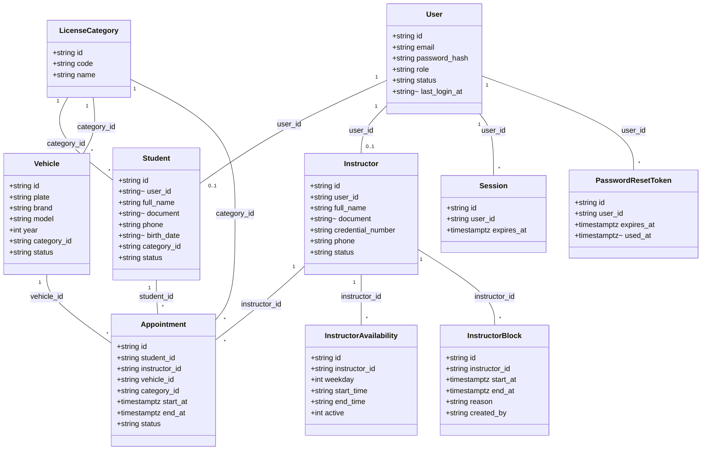

# Diagrama de classes (domínio e persistência)

Classes correspondentes às tabelas de `apps/api/src/database/migrations/` e aos tipos `*Record` de `apps/api/src/models/*Model.ts`. Como o projeto não usa ORM (SQL puro), "classe" aqui é o mesmo objeto que a tabela e que o `*Record` do model — não há uma camada de entidade separada.

**Nota**: `Appointment` tem `status` como coluna, mas hoje o único valor possível é `AGENDADA` — ver `estados-appointment.md`.
