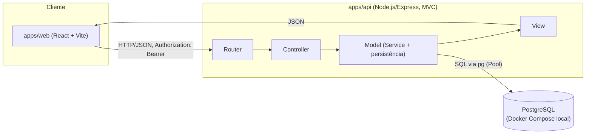

# Diagrama de componentes

```mermaid
flowchart LR
  subgraph Cliente
    Web["apps/web (React + Vite)"]
  end

  subgraph Servidor["apps/api (Node.js/Express, MVC)"]
    Router[Router]
    Controller[Controller]
    Model["Model (Service + persistência)"]
    View[View]
    Router --> Controller --> Model
    Model --> View
  end

  DB[("PostgreSQL\n(Docker Compose local)")]

  Web -- "HTTP/JSON, Authorization: Bearer" --> Router
  View -- JSON --> Web
  Model -- "SQL via pg (Pool)" --> DB
```

Monorepo Yarn (não é separado em serviços/repos distintos); `apps/web` nunca acessa o PostgreSQL diretamente (DOC-09 §1).
