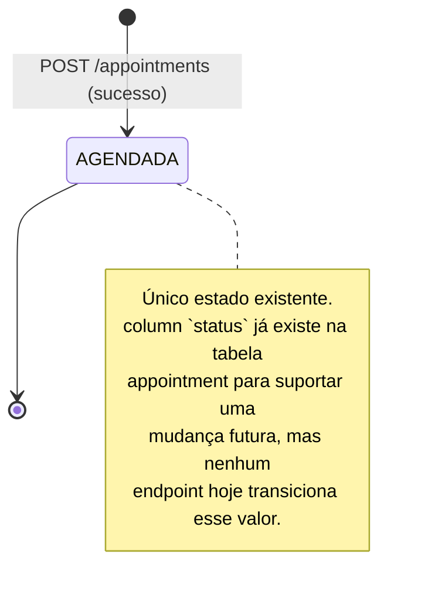

# Diagrama de estados — appointment

## Decisão de escopo

O PDF de referência pede um diagrama de estados de `appointment` assumindo um ciclo de vida completo (agendada → confirmada → em andamento → concluída/cancelada/ausência), como descrito em `docs/01_Visao_Escopo_Requisitos_Negocio.md` RN-018 a RN-024. Este projeto **não implementa esse ciclo de vida** — é um Non-Goal registrado desde a change `appointment-scheduling` e confirmado em todas as changes seguintes (`instructor-availability`, `migrate-db-to-postgres`): reagendar, cancelar, confirmar presença e concluir aula não existem em nenhum endpoint. Toda aula criada por `POST /appointments` permanece no único estado `AGENDADA`.

Documentamos essa decisão aqui, em vez de desenhar transições que não correspondem a nenhum código, para manter o diagrama honesto sobre o que foi de fato implementado.

**O que seria necessário para o ciclo completo** (fora de escopo desta entrega): endpoints `POST /appointments/:id/cancel`, `/confirm`, `/attendance`, `/complete`, `/not-performed`, regras de prazo (RN-018/RN-019) e o registro de auditoria (RN-024) — ver `docs/04_Especificacao_BackEnd_API.md` §5 para o desenho original.
