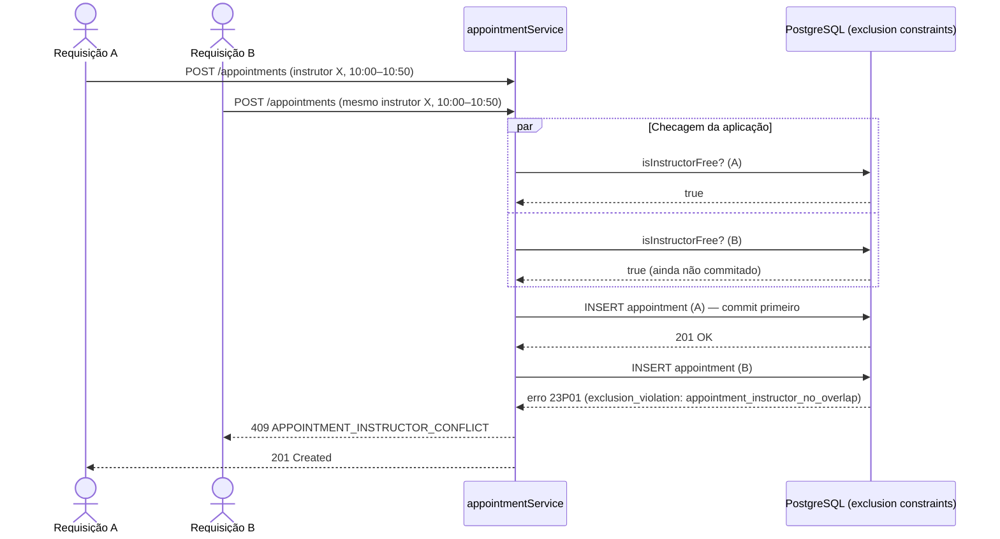

# Diagrama de sequência — tentativa de agendar horário já ocupado

O PDF pede um diagrama de "reagendar com conflito"; este projeto não implementa reagendamento (Non-Goal registrado em `appointment-scheduling`'s design.md), então este diagrama documenta o fluxo real de conflito que existe: duas tentativas de reserva no mesmo horário/recurso, coberto por `apps/api/tests/concurrency.test.ts`.

A checagem da aplicação (`isInstructorFree`) reduz a chance de conflito, mas quem garante a exclusão mútua sob concorrência real é a *exclusion constraint* do banco (migration `0007`) — ver `docs/04-banco/decisoes.md`.
