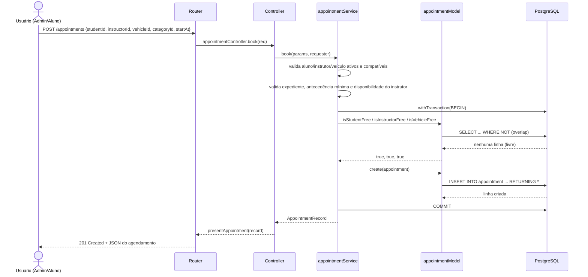

# Diagrama de sequência — criar agendamento (caminho feliz)

Corresponde a `POST /appointments`, implementado em `apps/api/src/models/appointmentService.ts` (`book`). Passa por Router → Controller → Model (Service + Model, dentro de uma transação) → View, conforme a arquitetura MVC descrita no README.

