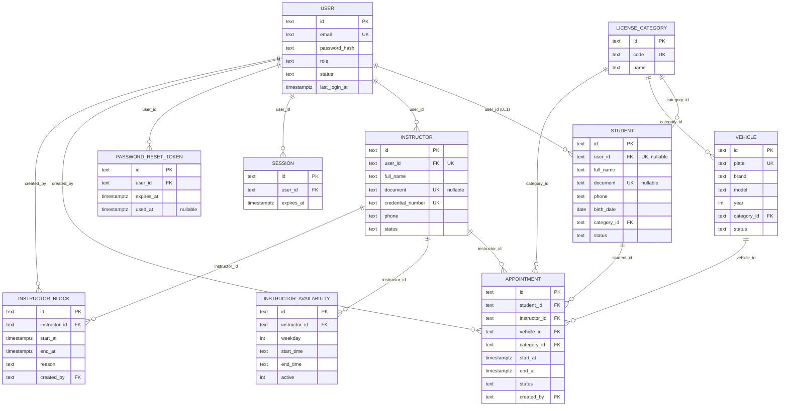

# DER (lógico e físico) — PostgreSQL

Gerado a partir de `apps/api/src/database/migrations/0001_create_user.sql` … `0010_create_instructor_block.sql` (as migrations *são* o projeto físico deste banco). Dicionário de dados completo em `docs/05_Banco_de_Dados_Dicionario.md`.

`appointment` também tem três *exclusion constraints* (não representáveis em notação DER clássica) — ver `decisoes.md`.
